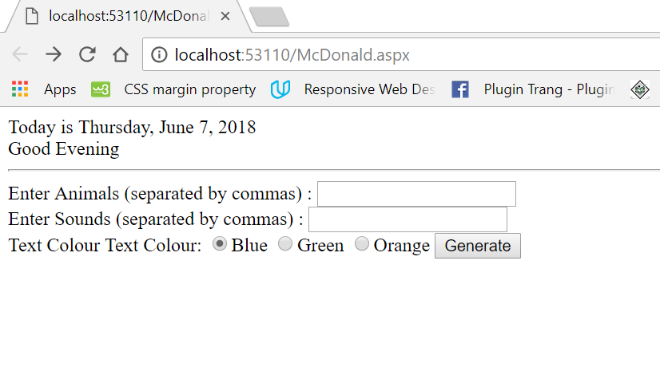
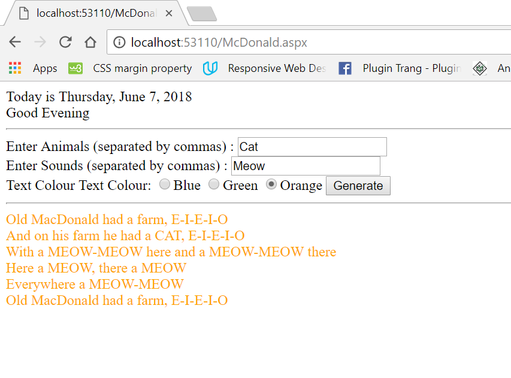
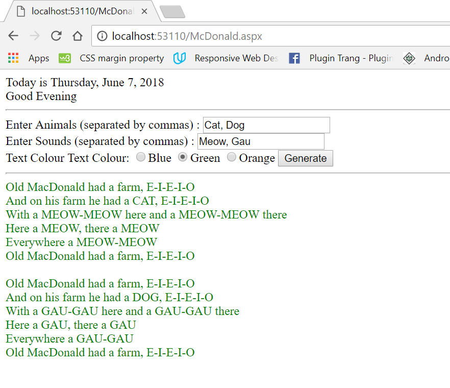

 <h5 class="w3-text-green"><b>The Interactive Lyric</b></h5>
     
Framework: <b> ASP.NET</b> 
     Languages: <b>C#, cshtml</b>

     
  The Song lyrics application is interactive and dynamic. 
       <li>	The user will enter an animal or list of animals separated by commas in a text box.</li>
          <li>The user will also enter a sound or list of corresponding sounds separated by commas in another text box. </li>
<li>The user can select what colour (blue, green or orange) the lyrics will be displayed.</li>
<li>	The animal names and their sounds will be displayed in uppercase letters. </li>
<li>	When the user clicks on the [Generate] button, the lyrics will be generated with the input animals and sounds in the specified colour.</li> 

<i class="fa fa-file-image-o"></i>  Here are screenshots of my application.
   

